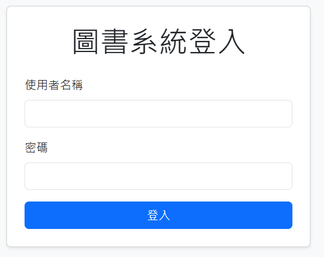
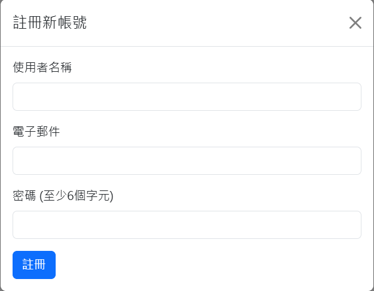
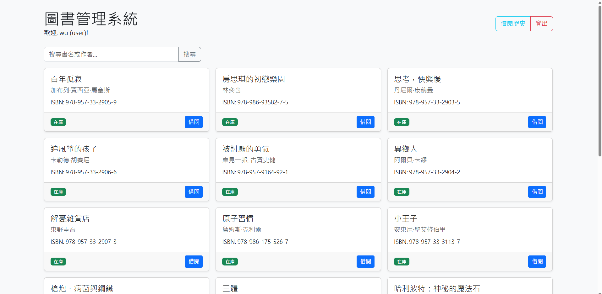
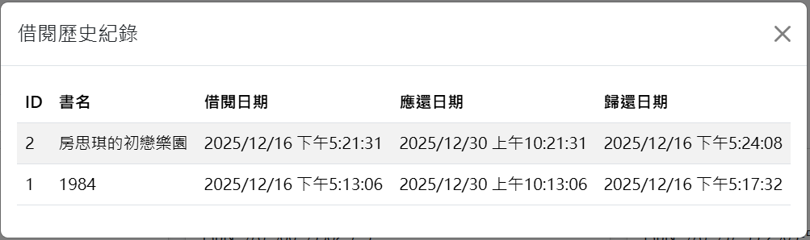
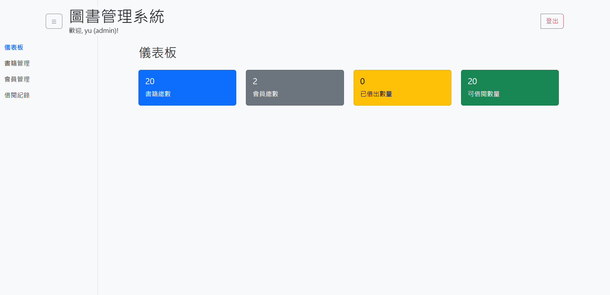
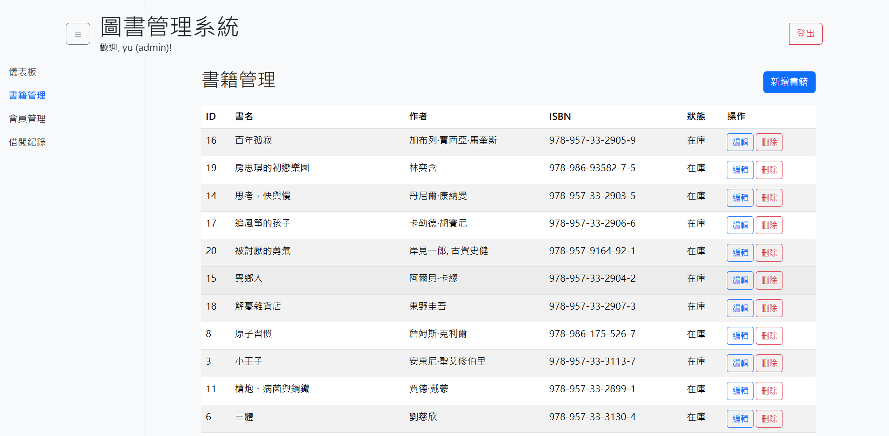
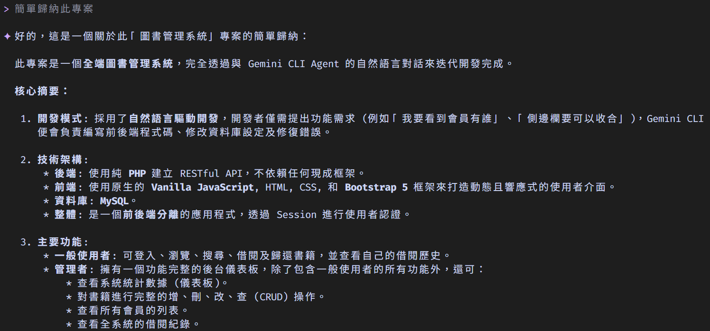

# 圖書管理系統 (Library Management System)

本專案是一個功能完善的圖書管理系統，完全透過與 Gemini CLI Agent 的自然語言對話來迭代開發完成。從無到有，展示了如何使用自然語言指令來建立、修正並擴展一個全端應用程式。

## 自然語言驅動開發 (Natural Language-Driven Development)

這個專案的開發流程完全基於開發者與 Gemini CLI 之間的互動。開發者僅需提出需求，Gemini CLI 便會負責分析、規劃、編寫程式碼以及除錯。

開發歷程摘要：
1.  **初始化與資料匯入**: 開發者提出建立圖書系統的需求，並要求匯入大量書籍資料。
2.  **角色權限系統**: 根據「一般使用者」與「管理者」的需求，建立了前後端的角色權限分離機制。
3.  **功能實作**:
    *   為管理者加入了書籍的 CRUD (新增、讀取、修改、刪除) 功能。
    *   為一般使用者實作了書籍的借閱與歸還功能。
4.  **後台儀表板**: 根據需求，為管理者打造了一個功能齊全的後台，包含：
    *   **儀表板 (Dashboard)**: 顯示書籍、會員、借閱狀態的即時統計數據。
    *   **會員管理 (User Management)**: 瀏覽所有註冊會員的列表。
    *   **借閱紀錄 (Borrowing Records)**: 查看全站所有的借閱歷史。
5.  **使用者體驗優化**:
    *   為後台加入了可收合的側邊欄，並修復了因此產生的 UI 顯示問題。
    *   為不同使用者角色動態產生對應的操作介面。

## 技術棧 (Tech Stack)

-   **後端 (Backend)**:
    -   **PHP 8.x**: 使用純 PHP 編寫，不依賴任何框架，負責處理所有商業邏輯與資料庫互動。
    -   **RESTful API**: 後端透過 JSON 格式提供符合 RESTful 原則的 API。
-   **前端 (Frontend)**:
    -   **HTML5 / CSS3**: 建立網頁結構與樣式。
    -   **Vanilla JavaScript (ES6+)**: 使用原生 JavaScript 處理所有前端互動、API 請求與 DOM 操作。
    -   **Bootstrap 5**: 用於快速建立響應式且美觀的使用者介面。
-   **資料庫 (Database)**:
    -   **MySQL**: 透過 XAMPP 環境運行，用於儲存所有書籍、使用者及借閱紀錄資料。
-   **架構 (Architecture)**:
    -   **前後端分離**: 嚴格分離前端畫面與後端邏輯，透過 `Fetch API` 進行非同步數據交換。
    -   **Session-based Authentication**: 使用 PHP Session 來管理使用者登入狀態與權限。

## 核心功能 (Core Features)

### 一般使用者 (user)
-   **登入系統**: 驗證使用者身份。
-   **瀏覽書籍**: 以卡片形式查看所有館藏書籍。
-   **即時搜尋**: 可根據書名或作者關鍵字即時過濾書籍列表。
-   **借閱書籍**: 對於「在庫」狀態的書籍，可進行借閱。
-   **歸還書籍**: 可歸還自己已借閱的書籍。
-   **查看個人借閱歷史**: 透過彈出視窗查看自己的借閱紀錄。

### 管理者 (admin)
包含所有一般使用者功能，並額外擁有完整的後台管理儀表板：
-   **儀表板 (Dashboard)**: 視覺化呈現系統關鍵指標，包含書籍總數、會員總數、已借出和可借閱數量。
-   **書籍管理 (Book Management)**:
    -   以表格形式查看所有書籍。
    -   新增、編輯、刪除任何一本書籍。
-   **會員管理 (User Management)**: 以表格形式查看所有註冊會員的資訊。
-   **借閱紀錄 (Borrowing Records)**: 查看系統中所有使用者的完整借閱歷史。
-   **可收合側邊欄**: 方便最大化內容可視區域。

## 安裝與設定 (Setup & Installation)

1.  **環境設定**:
    *   安裝一個支援 PHP 8+ 和 MySQL 的本地伺服器環境，例如 [XAMPP](https://www.apachefriends.org/) 或 WAMP。
2.  **資料庫建立**:
    *   啟動 Apache 與 MySQL 服務。
    *   進入 `phpMyAdmin`。
    *   建立一個名為 `library_system` 的新資料庫。
    *   選擇 `library_system` 資料庫，點擊「匯入」(Import) 分頁，並選擇專案根目錄下的 `database.sql` 檔案來建立所需的資料表。
3.  **專案檔案**:
    *   將整個專案資料夾複製到您的網頁伺服器根目錄下 (例如 XAMPP 的 `htdocs` 資料夾)。
4.  **建立使用者**:
    *   您可以直接在 `phpMyAdmin` 的 `users` 資料表中手動新增使用者。
    *   **密碼**: 密碼欄位需填入使用 `password_hash()` 函式加密後的字串。您可以使用 `backend/register_user.php` 來註冊新使用者，它會自動處理加密。
    *   **角色**: `role` 欄位可設為 `user` 或 `admin`。
5.  **啟動**:
    *   在瀏覽器中開啟 `http://localhost/{您的專案資料夾名稱}/` 即可看到登入頁面。

## 專案結構 (Project Structure)
```
/
├── backend/           # 存放所有 PHP 後端 API 邏輯
│   ├── admin_stats.php
│   ├── borrow_book.php
│   ├── create_book.php
│   ├── ... (其他 API 檔案)
├── assets/            # 存放前端靜態資源
│   ├── css/style.css
│   └── js/main.js
├── database.sql       # 資料庫結構檔
├── index.html         # 系統主入口
└── README.md          # 本說明檔案
```

## 系統畫面展示 (Screenshots)

### 登入頁面



### 一般使用者介面



### 管理者後台



### 總結

